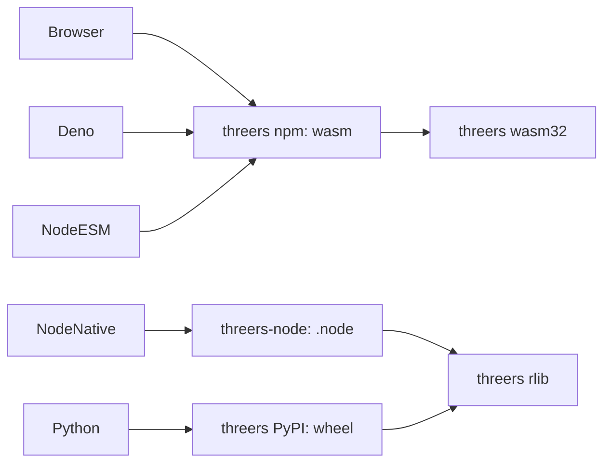

# Language bindings (wasm ESM, napi-rs, PyO3)

threers ships one Rust core and three language packages. They are **not**
interchangeable runtimes — pick by host.

| Package | Registry | Binding | Best for |
|---------|----------|---------|----------|
| `threers` / `threers/mini` | npm / Deno | wasm + THREE shim (small) | Browser default download |
| `threers/full` | npm / Deno | wasm + THREE shim (`wasm-full`) | Browser CAD / codecs / path tracer |
| `threers-node` | npm | **napi-rs** native addon ([`crates/threers-node`](../crates/threers-node)) | Node headless / native GPU on the host |
| `threers` | PyPI | **PyO3** / maturin ([`crates/threers-py`](../crates/threers-py)) | Python tooling / notebooks |
| `threers` | crates.io | Rust rlib | Native Rust apps |

## Neon vs napi-rs

Neon-style macros (`#[neon::export]` / `#[napi]`) are the right *shape* for a
native Node addon. **Neon itself is not used** here:

- Deno and the browser stay on **wasm ESM** — Neon does not help them.
- **napi-rs** gives the same macro ergonomics, auto-generated `.d.ts`, and the
  standard multi-arch optional-dependency layout (`@threers/node-darwin-arm64`, …).

## Architectures

| Package | Arch story |
|---------|------------|
| `threers` (npm ESM) | **Two** wasm builds in one package: **`mini`** (default `.`) and **`full`** (`wasm-full`). Each is arch-independent — not split by arm/x64. Bundlers only download the entry you import. |
| `threers-node` | Per OS/CPU `.node` via optional deps (darwin-arm64, darwin-x64, linux-x64-gnu, linux-arm64-gnu, win32-x64-msvc). |
| `threers` (PyPI) | Per-platform wheels (macOS arm64/x86_64, manylinux x86_64/aarch64, Windows x64) via maturin / cibuildwheel. |
| crates.io | Source; consumers compile for their target triple. |

CI: [`.github/workflows/release-language-packages.yml`](../.github/workflows/release-language-packages.yml).

Local orchestration: [`scripts/release-all.sh`](../scripts/release-all.sh) (`pack` / `PUBLISH=1 publish`).

Examples (THREE.* first): [`crates/examples/README.md`](../crates/examples/README.md).

## Surface parity (napi ↔ Python)

Day-one native bindings mirror each other:

- `version`, `Vector3`, `Color`, `Scene`, `PerspectiveCamera`
- Feature-gated: `HeadlessRenderer`, `Tween`, `PhysicsWorld`

The browser THREE.* API remains the wasm shim — not reimplemented in napi.
