# Examples

Every example that draws something, with the picture it draws. Each was
produced by running the command beside it on a headless wgpu device — the
same code path a CI job or a server would use, no window and no display.

Images are 640 px JPEGs regenerated from the examples themselves; they live
in [`docs/images/`](images/) and are excluded from the published crate.

39 of them. The rest of the examples are interactive (winit), export
video rather than a frame, or print numbers — see [`examples/`](../examples/).

| | |
|---|---|
| <a href="images/captions_render.jpg">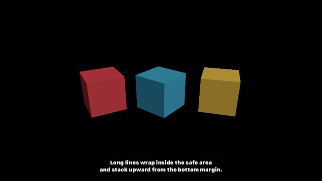</a> | **`captions_render`** Captions over a 3D render, both ways: composited on the GPU by the renderer's overlay pass, and painted on the CPU into an RGBA buffer.  `cargo run --release --example captions_render`  5 images; the largest is shown |
| <a href="images/cuboct.jpg">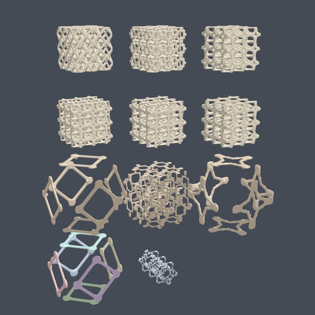</a> | **`cuboct`** Face-connected cuboct voxels (Jenett et al., Sci. Adv. 2020).  `cargo run --release --example cuboct` |
| <a href="images/denoise_ab.jpg">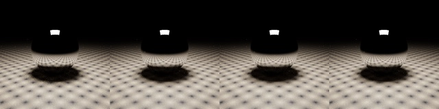</a> | **`denoise_ab`** Visual A/B of À-Trous widths: fitted albedo gate vs a restored tight one.  `cargo run --release --features raytrace --example denoise_ab`  10 images; the largest is shown |
| <a href="images/denoise_compare.jpg">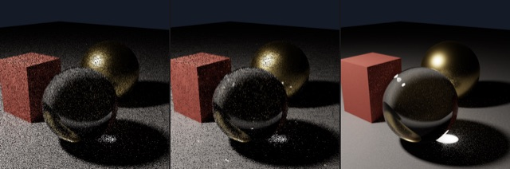</a> | **`denoise_compare`** One scene, four ways: raw, À-Trous, a trained network, and the reference.  `cargo run --release --features raytrace --example denoise_compare`  4 images; the largest is shown |
| <a href="images/earth_sun_flare.jpg">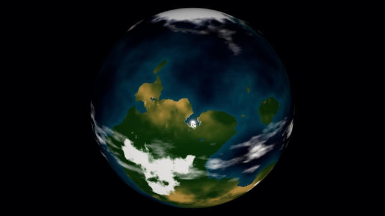</a> | **`earth_sun_flare`** Earth lit by the sun, with a lens flare — a full PBR scene from procedural high-resolution textures, no asset downloads.  `cargo run --release --example earth_sun_flare`  3 images; the largest is shown |
| <a href="images/hdri_lighting.jpg">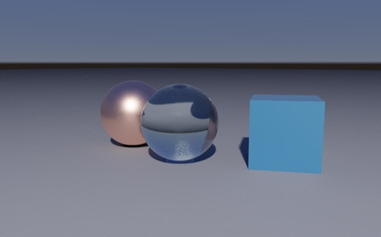</a> | **`hdri_lighting`** Image-based lighting: one HDRI, no lights at all.  `cargo run --release --features raytrace --example hdri_lighting` |
| <a href="images/ik_servo_demo.jpg">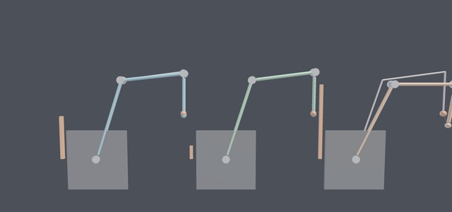</a> | **`ik_servo_demo`** Visual demo: three identical arms track the same IK path under different transmissions — direct drive, QDD (15:1), and a high-ratio servo (288:1).  `cargo run --release --example ik_servo_demo`  6 images; the largest is shown |
| <a href="images/kirigami.jpg">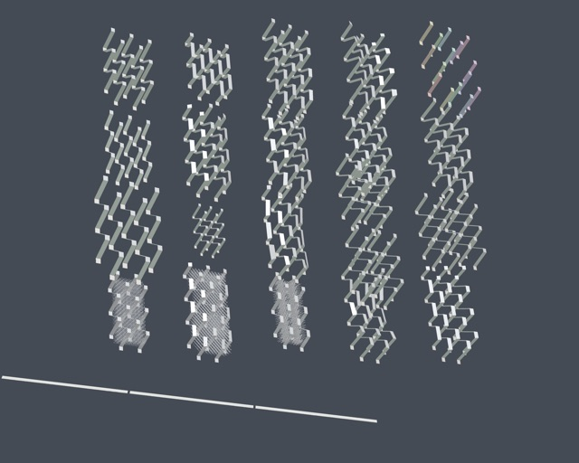</a> | **`kirigami`** Kirigami Expanded Miura — gallery of folded states, plus crease-pattern nets.  `cargo run --release --example kirigami` |
| <a href="images/lattice.jpg">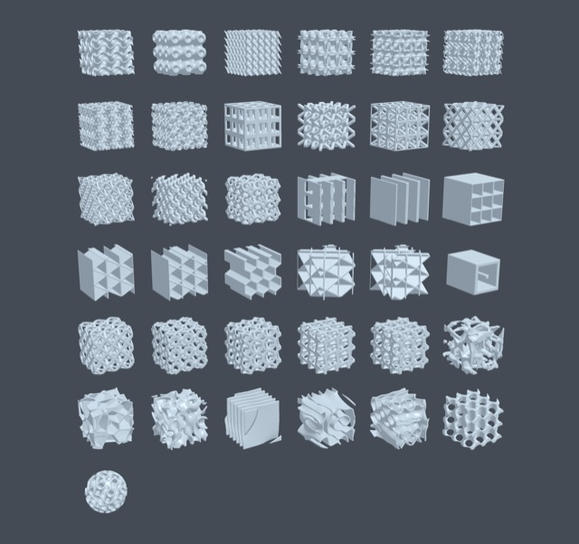</a> | **`lattice`** Every lattice generator, rendered headless to a PNG.  `cargo run --release --example lattice` |
| <a href="images/lattice_engineering.jpg">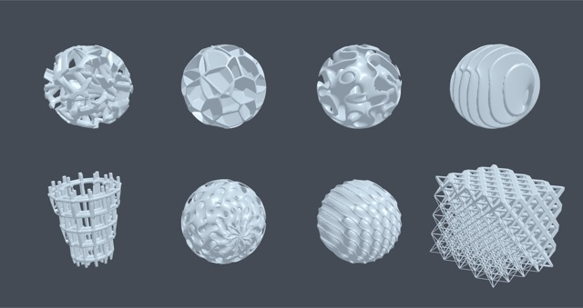</a> | **`lattice_engineering`** Lattices as engineering, not decoration: foams, conformal cells, a field-driven grade, and the numbers that come out of all of it.  `cargo run --release --example lattice_engineering` |
| <a href="images/lattice_shapes.jpg">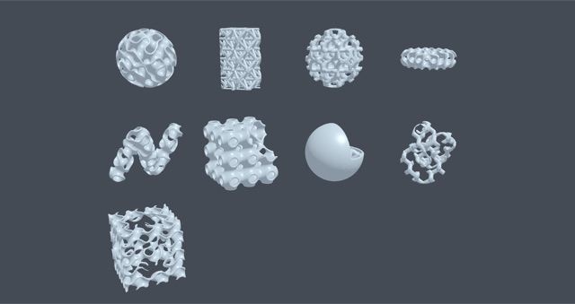</a> | **`lattice_shapes`** Lattices poured into shapes rather than boxes, rendered headless to a PNG.  `cargo run --release --example lattice_shapes` |
| <a href="images/material_chart.jpg">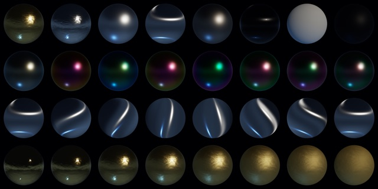</a> | **`material_chart`** Headless contact sheet of the spacecraft material presets and the extended PBR layers, rendered to a PNG.  `cargo run --release --example material_chart`  2 images; the largest is shown |
| <a href="images/metal_headless.jpg">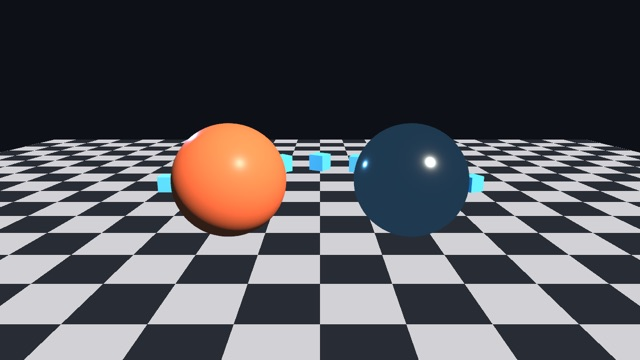</a> | **`metal_headless`** Offscreen rendering through the Metal backend.  `cargo run --release --features metal --example metal_headless` |
| <a href="images/metal_stereo.jpg">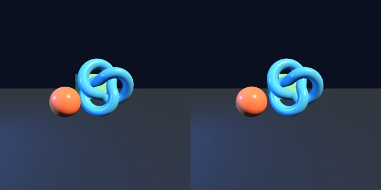</a> | **`metal_stereo`** Stereo rendering through the Metal backend — the visionOS frame shape, offscreen so it can be run on a Mac.  `cargo run --release --features metal --example metal_stereo` |
| <a href="images/nema17.jpg">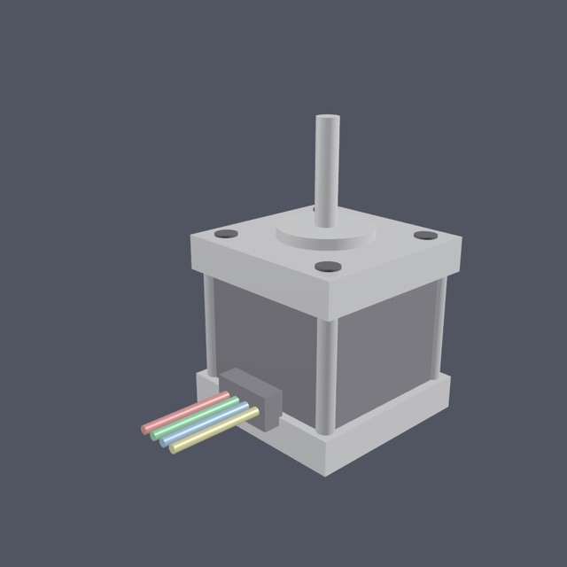</a> | **`nema17`** Detailed **NEMA 17 stepper motor** — a single-part assembly shown on its own.  `cargo run --release --features openscad --example nema17` |
| <a href="images/openscad_render.jpg">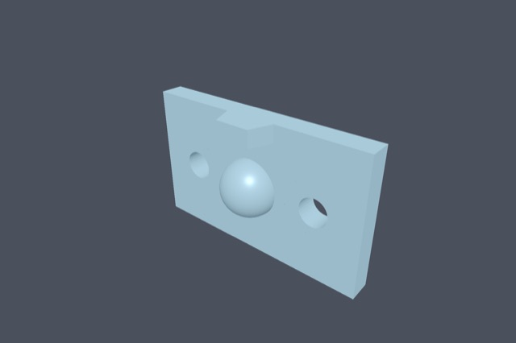</a> | **`openscad_render`** Headless render of the OpenSCAD-style `Solid` front end → PNG, so you can *see* it working end-to-end (`--features openscad`).  `cargo run --release --features openscad --example openscad_render` |
| <a href="images/origami.jpg">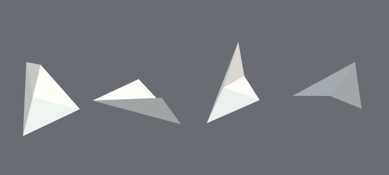</a> | **`origami`** Figure 1 of arXiv:1812.01160 — a single degree-4 vertex, two rigid modes.  `cargo run --release --example origami` |
| <a href="images/origami_gallery.jpg">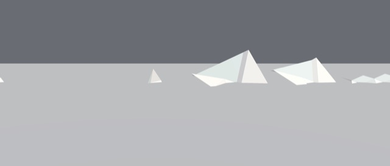</a> | **`origami_gallery`** Contact sheet of rigid-origami gadgets.  `cargo run --release --example origami_gallery` |
| <a href="images/origami_miura.jpg">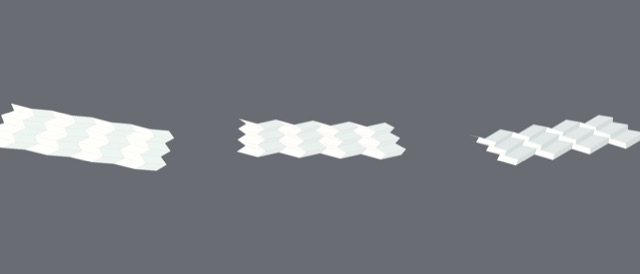</a> | **`origami_miura`** Miura-ori tessellation — a rigidly foldable sheet from a seed mode.  `cargo run --release --example origami_miura` |
| <a href="images/origami_twist.jpg">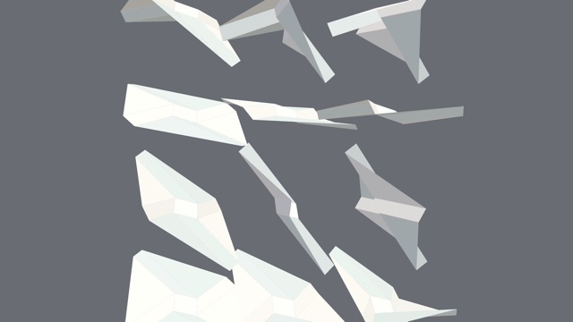</a> | **`origami_twist`** Square twist — Lemma 14 of arXiv:1812.01160.  `cargo run --release --example origami_twist` |
| <a href="images/path_trace.jpg">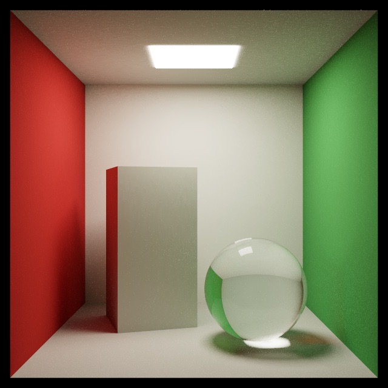</a> | **`path_trace`** A Cornell box, path traced.  `cargo run --release --features raytrace --example path_trace`  8 images; the largest is shown |
| <a href="images/path_trace_gpu.jpg">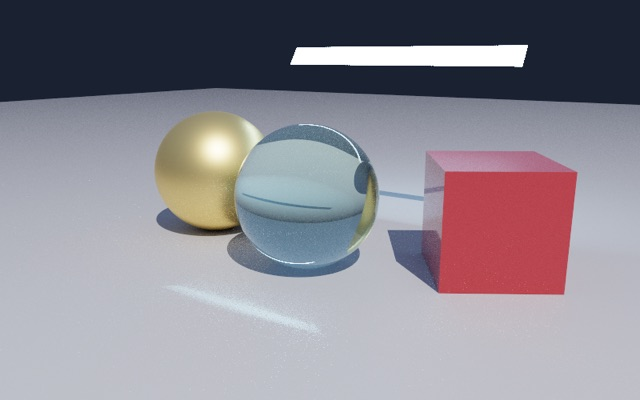</a> | **`path_trace_gpu`** The same path tracer on the GPU, timed against the CPU.  `cargo run --release --features raytrace --example path_trace_gpu`  2 images; the largest is shown |
| <a href="images/pole_probe.jpg">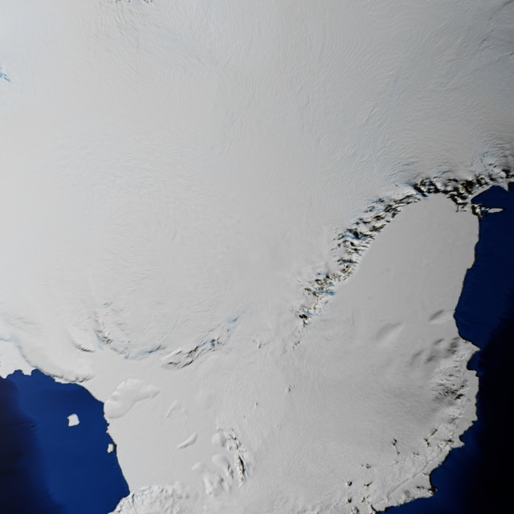</a> | **`pole_probe`** Renders the north pole from the real NASA maps, one contributing map at a time, so the polar fan can be attributed to a specific one.  `cargo run --release --features planet --example pole_probe`  10 images; the largest is shown |
| <a href="images/printer_assembly.jpg">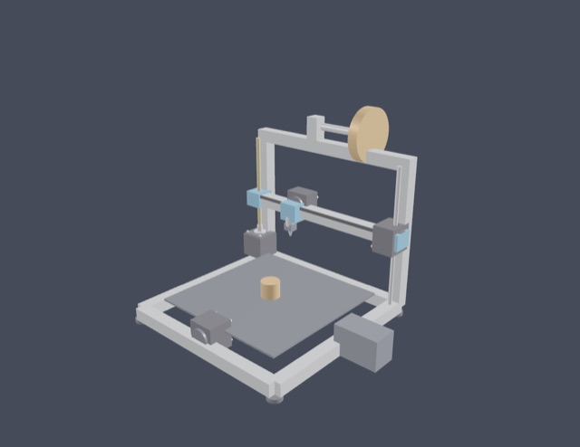</a> | **`printer_assembly`** Parametric Cartesian **3D printer assembly** — with NEMA 17 stepper motors.  `cargo run --release --features openscad --example printer_assembly` |
| <a href="images/progressive_denoise.jpg">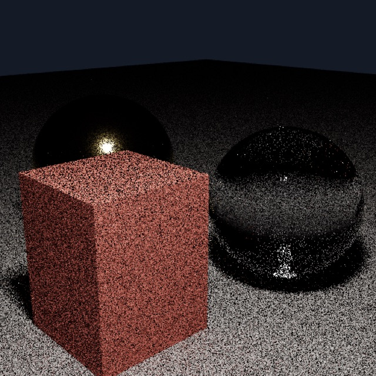</a> | **`progressive_denoise`** **Progressive path tracing with the denoiser in the loop** — write a frame after each batch of samples, denoised, so the image is usable long before…  `cargo run --release --features raytrace --example progressive_denoise`  64 images; the largest is shown |
| <a href="images/realistic_earth.jpg">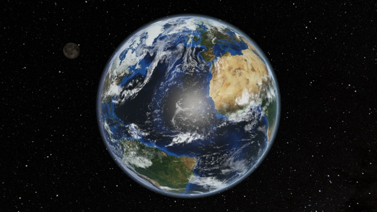</a> | **`realistic_earth`** A realistic Earth from NASA imagery, in about a hundred lines of setup.  `cargo run --release --features planet --example realistic_earth` |
| <a href="images/rlx_conv_postfx.jpg">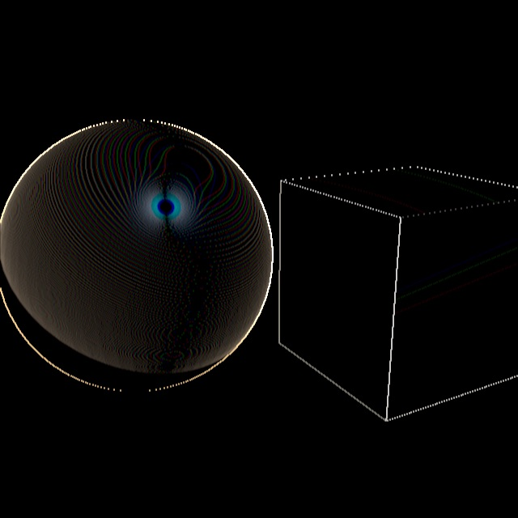</a> | **`rlx_conv_postfx`** Post-processing as compiled rlx graphs (`--features rlx`).  `cargo run --release --features rlx --example rlx_conv_postfx`  6 images; the largest is shown |
| <a href="images/rlx_fit_grade.jpg">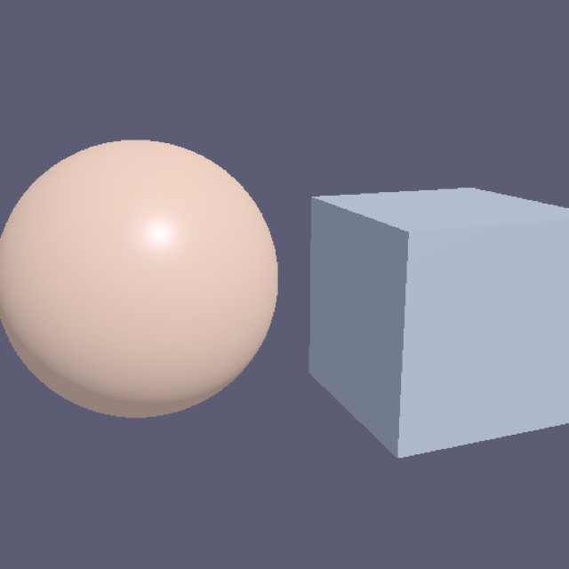</a> | **`rlx_fit_grade`** Learn a colour grade from a reference, by gradient descent (`--features rlx`).  `cargo run --release --features rlx --example rlx_fit_grade`  5 images; the largest is shown |
| <a href="images/rlx_frame_filter.jpg">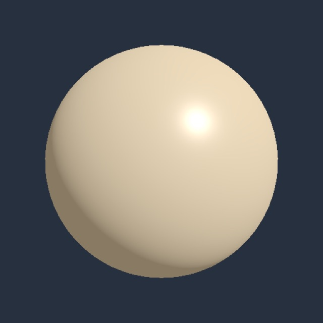</a> | **`rlx_frame_filter`** Run an RLX graph over a rendered frame (`--features rlx`).  `cargo run --release --features rlx --example rlx_frame_filter`  2 images; the largest is shown |
| <a href="images/rlx_geo_erosion.jpg">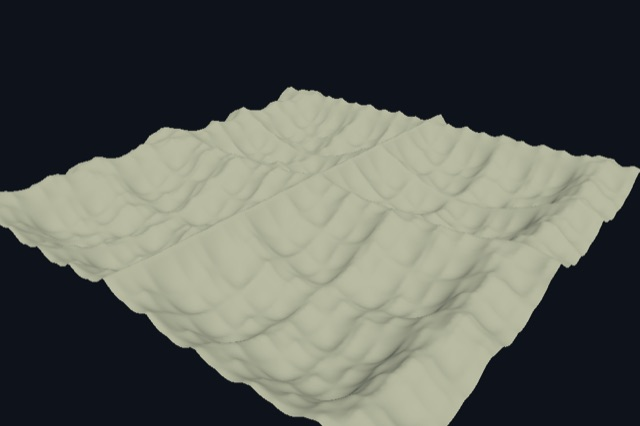</a> | **`rlx_geo_erosion`** Terrain diffusion as an iterated graph (`--features rlx,rlx-geo`).  `cargo run --release --features rlx,rlx-geo --example rlx_geo_erosion`  2 images; the largest is shown |
| <a href="images/rlx_geo_materials.jpg">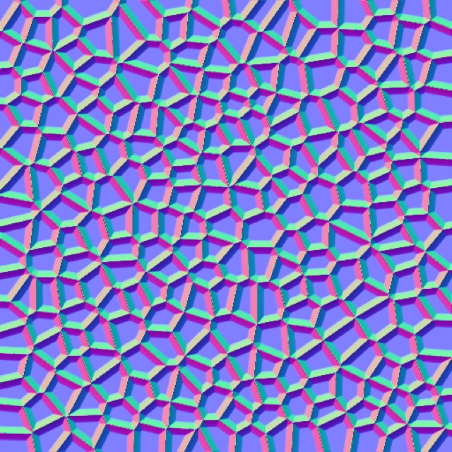</a> | **`rlx_geo_materials`** Voronoi cells as material maps (`--features rlx-geo`).  `cargo run --release --features rlx-geo --example rlx_geo_materials`  4 images; the largest is shown |
| <a href="images/rlx_geo_refine.jpg">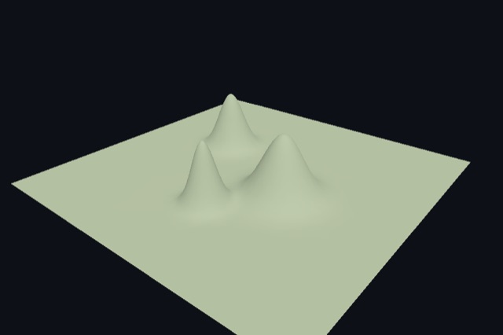</a> | **`rlx_geo_refine`** Adaptive Delaunay refinement, against a uniform grid (`--features rlx-geo`).  `cargo run --release --features rlx-geo --example rlx_geo_refine`  2 images; the largest is shown |
| <a href="images/rlx_geo_terrain.jpg">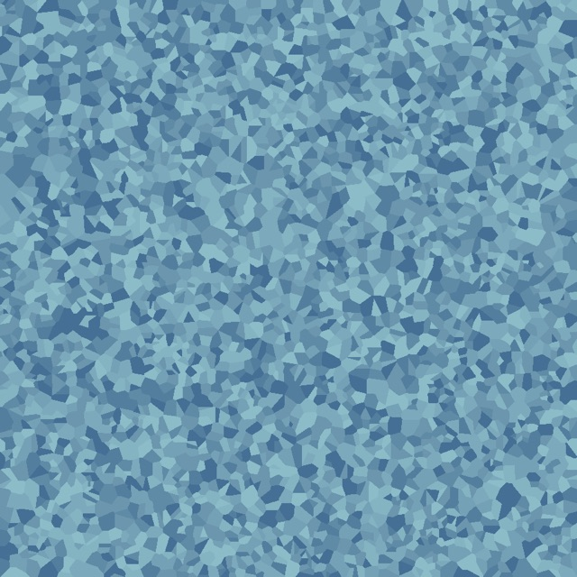</a> | **`rlx_geo_terrain`** Exact Delaunay and Voronoi through `rlx-geo` (`--features rlx-geo`).  `cargo run --release --features rlx-geo --example rlx_geo_terrain`  2 images; the largest is shown |
| <a href="images/rlx_mesh_smooth.jpg">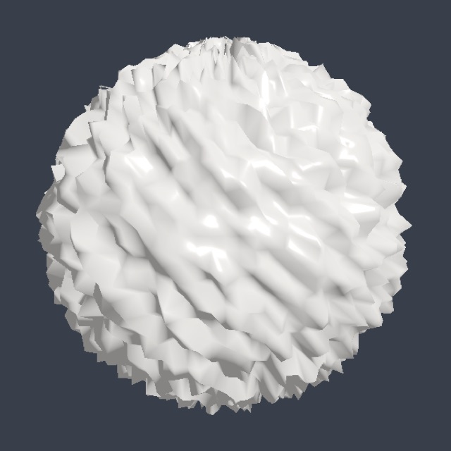</a> | **`rlx_mesh_smooth`** Mesh smoothing as a graph over the positions tensor (`--features rlx`).  `cargo run --release --features rlx --example rlx_mesh_smooth`  3 images; the largest is shown |
| <a href="images/rlx_palette.jpg">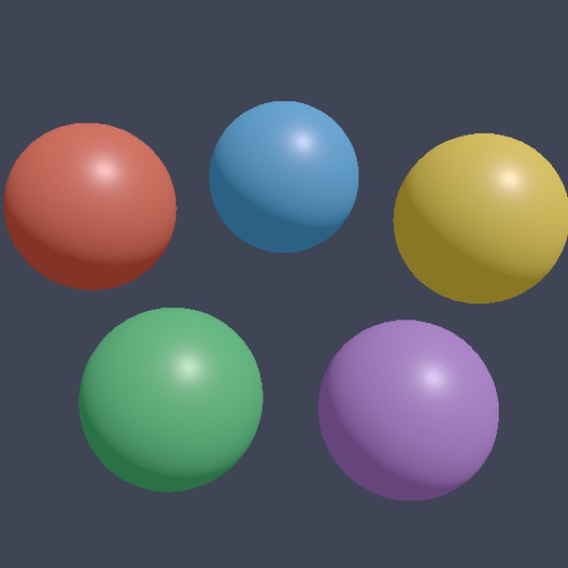</a> | **`rlx_palette`** Palette extraction, and a mosaic built from it (`--features rlx,rlx-geo`).  `cargo run --release --features rlx,rlx-geo --example rlx_palette`  4 images; the largest is shown |
| <a href="images/scad_profile.jpg">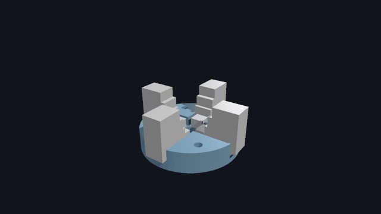</a> | **`scad_profile`** Where a SCAD animation's time goes.  `cargo run --release --features openscad --example scad_profile` |
| <a href="images/spacecraft_render.jpg">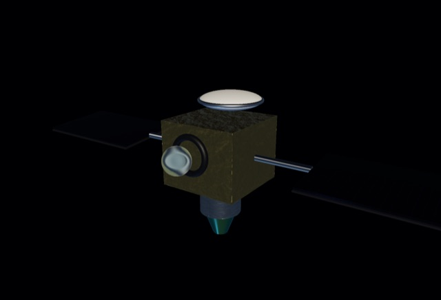</a> | **`spacecraft_render`** Headless PNG render of the same spacecraft as `spacecraft_materials`, for machines with no display (CI, servers, remote boxes).  `cargo run --release --example spacecraft_render`  2 images; the largest is shown |
| <a href="images/starfield_probe.jpg">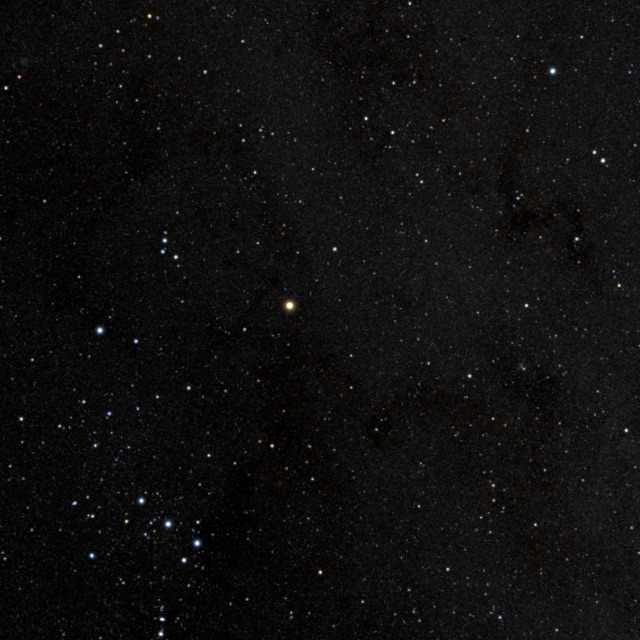</a> | **`starfield_probe`** What the sky sphere does to point sources.  `cargo run --release --features planet --example starfield_probe`  10 images; the largest is shown |
| <a href="images/viewport_path_trace.jpg">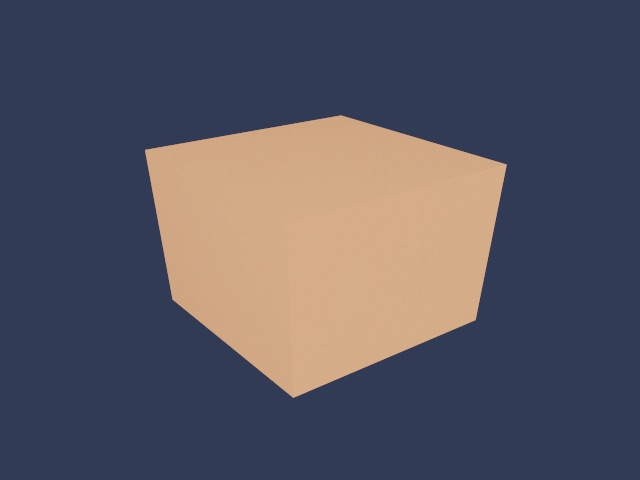</a> | **`viewport_path_trace`** Interactive viewport-style path tracing: rebuild the scene only when it changes, reuse the BVH across camera moves, and resolve progressive frames.  `cargo run --release --features raytrace --example viewport_path_trace`  2 images; the largest is shown |
